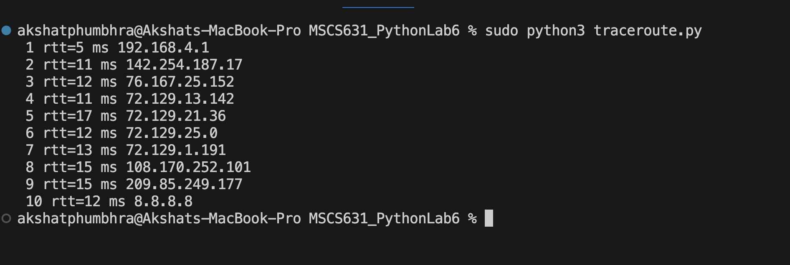
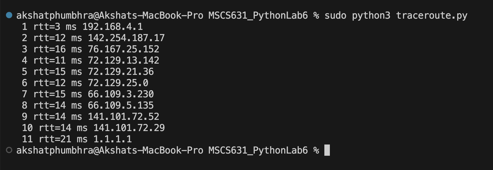
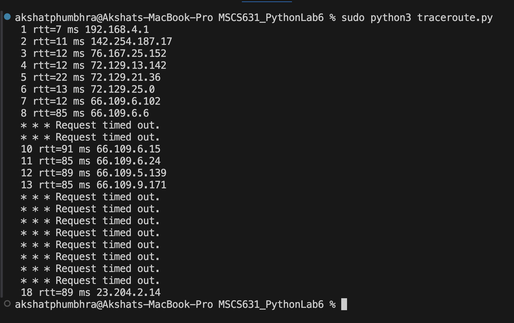
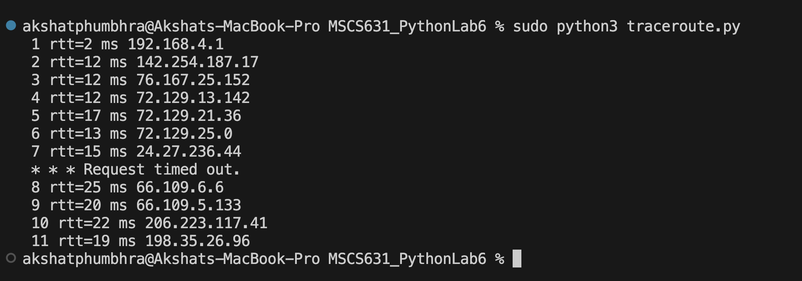

# Lab 6: Traceroute

### Oishani Ganguly

## Reflection on the Lab Experience

This ICMP traceroute lab provided valuable hands-on experience with low-level network programming and packet manipulation. Working with raw sockets deepened my understanding of how network diagnostic tools operate at the protocol level. The lab effectively demonstrated the relationship between IP TTL fields and ICMP messages, showing how routers respond with Time Exceeded messages when packets expire. Implementing the checksum calculation and packet building functions reinforced concepts about network packet structure and data integrity verification. Testing the traceroute against different target hosts revealed real-world network topologies and routing paths, making abstract networking concepts tangible. The lab successfully bridged theoretical knowledge with practical implementation, enhancing my comprehension of internet infrastructure and diagnostic methodologies.

## Challenges Encountered

The primary challenge was handling Python 3 compatibility issues, particularly with the checksum function where byte handling differed from Python 2 syntax. Raw socket programming required administrator privileges, initially causing permission errors until proper sudo access was established. Exception handling proved problematic, as socket timeout exceptions needed specific handling to prevent program crashes. Network firewalls and security software initially blocked ICMP traffic, requiring temporary disabling for successful packet transmission. Some target hosts and intermediate routers dropped ICMP packets, resulting in timeouts that needed graceful handling rather than program termination. Debugging packet parsing was complex, requiring careful attention to byte offsets and struct unpacking. Understanding the relationship between IP headers and ICMP payload positioning required multiple iterations to correctly extract timing information from received packets.

## Screenshots

*Traceroute to Google DNS Server (8.8.8.8)
This traceroute shows a successful 10-hop path to Google's public DNS server. The route travels through the local router (192.168.4.1), ISP infrastructure (142.254.187.17, 76.167.25.152), and multiple backbone routers (72.129.x.x series) before reaching intermediate servers (108.170.252.101, 209.85.249.177) and finally arriving at the Google DNS server with round-trip times ranging from 5-17ms.*

---

*Traceroute to Cloudflare DNS Server (1.1.1.1)
This traceroute demonstrates an 11-hop path to Cloudflare's public DNS service. The initial hops follow the same ISP path as the Google trace, but diverge at hop 7 through different backbone infrastructure (66.109.x.x and 141.101.72.x series) before reaching the Cloudflare server. The final destination shows a 21ms round-trip time, indicating successful completion of the trace.*

---

  
*Traceroute to MIT Educational Domain (mit.edu)
This traceroute shows a partial path toward MIT's servers with some timeouts occurring. The trace successfully reaches 13 hops through ISP infrastructure and backbone routers (66.109.x.x series), but encounters several "Request timed out" messages at hops 9 and 14-17, which is common when routers don't respond to ICMP packets. The trace eventually reaches hop 18 (23.204.2.14) with an 89ms round-trip time.*

---

  
*Traceroute to Wikipedia Domain (wikipedia.org)
This traceroute displays an 11-hop path to Wikipedia's servers. The route follows the familiar ISP path through the first 6 hops, then continues through different backbone infrastructure including a timeout at hop 8, before reaching servers at 66.109.x.x addresses and finally terminating at Wikipedia's content delivery network (206.223.117.41, 198.35.26.96) with round-trip times between 19-25ms.*